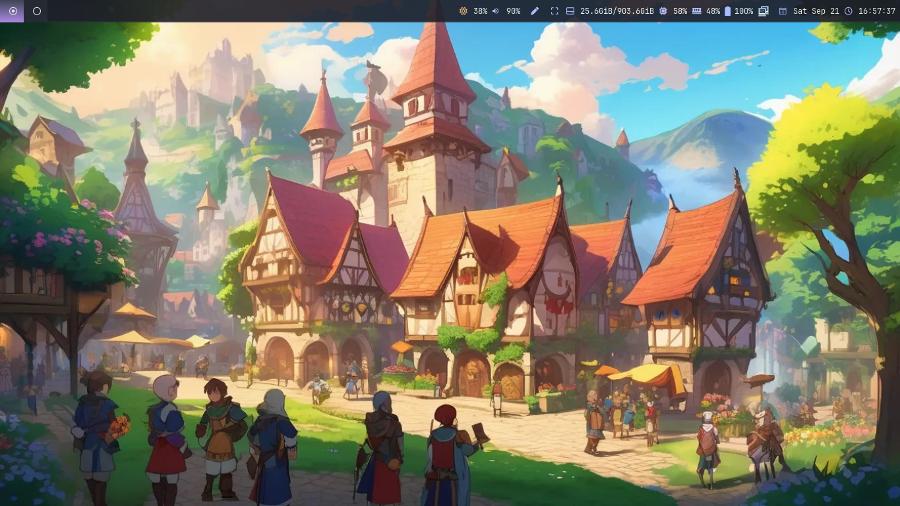
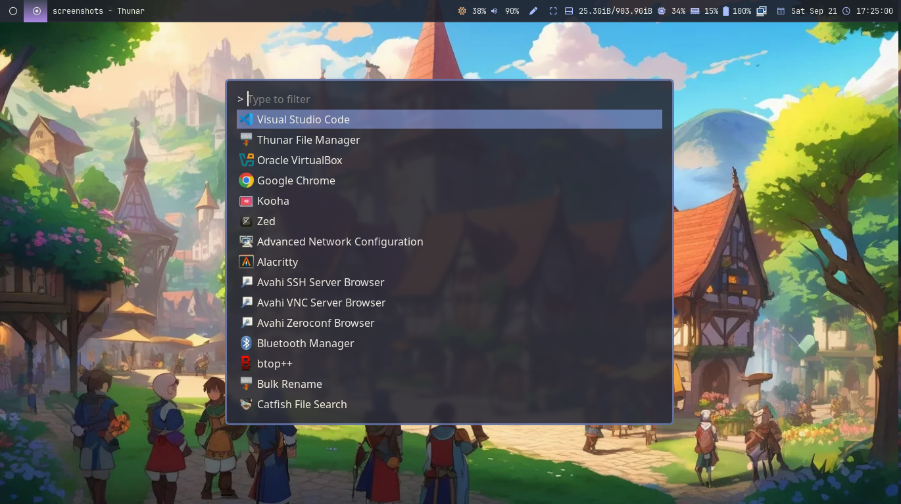
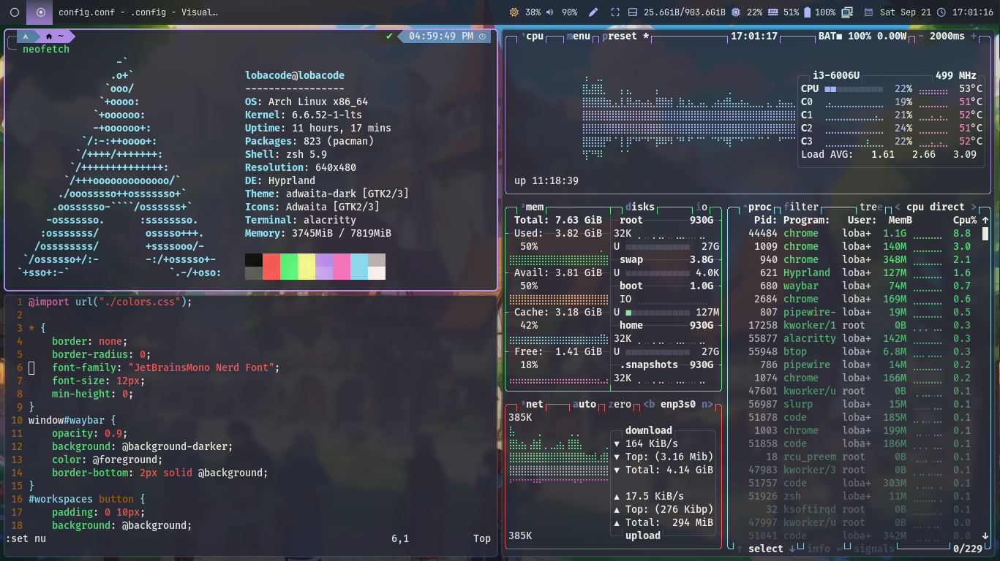
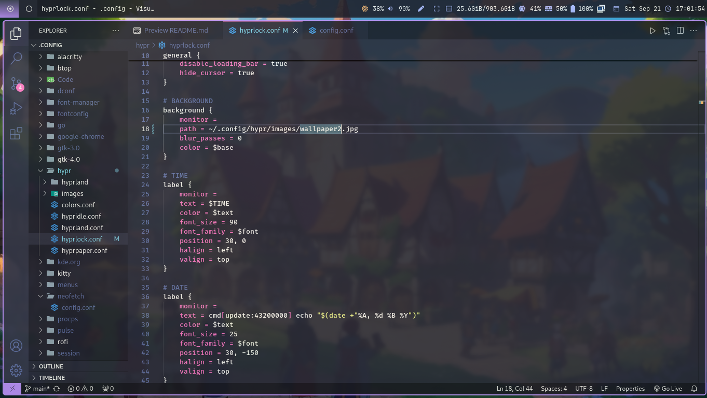

# dotfiles

### Overview

I am using [Dracula](https://draculatheme.com/) theme for all application.

* Window Manager: [Hyprland](https://github.com/hyprwm/Hyprland)
* Terminal: [Alacritty](https://alacritty.org/)
* Shell: [Oh My Zsh](https://ohmyz.sh/#install)

